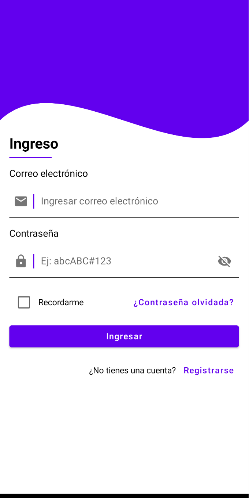
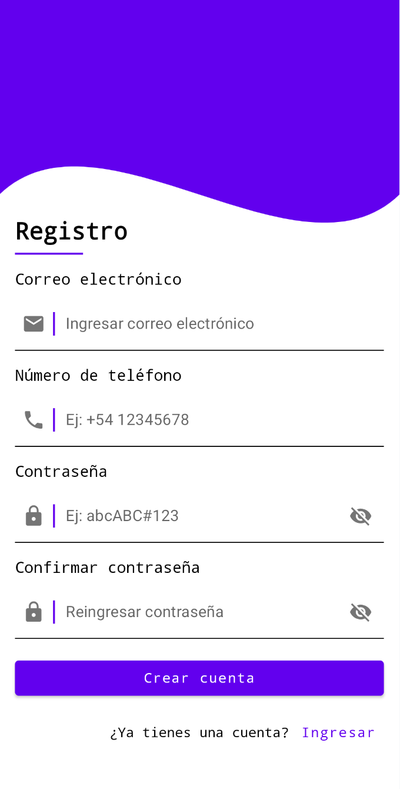

# Proyecto UI Design: Login-Signup

Este proyecto es una aplicación móvil demostrativa que evalúa las habilidades de diseño de interfaces gráficas para aplicaciones móviles.

## Descripción del Proyecto

El objetivo es crear pantallas para **Acceso a la cuenta (Login)** y **Creación de cuenta (Signup)**, con un enfoque en diseño moderno y funcional.

## Funcionalidades
- Pantalla de login con validación.
- Pantalla de registro de usuarios.

### Pantalla de Login

### Pantalla de Signup

## Instalación

1. Clonar el repositorio.
2. Abrir en Android Studio.
3. Ejecutar en un emulador o dispositivo físico.

## Tecnologías Usadas
- Kotlin
- Jetpack Compose
